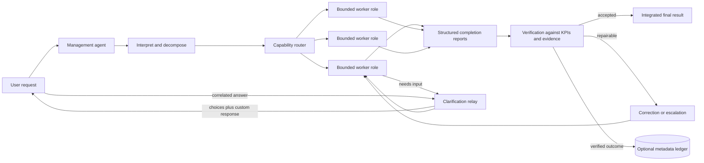

# Adaptive Agent Orchestrator

Adaptive Agent Orchestrator is a model-neutral orchestration skill for decomposing complex AI work, assigning bounded specialist roles, compiling bounded chat context, learning governed lessons from accepted feedback, routing by capability instead of model branding, verifying outputs against measurable KPIs, and integrating only accepted results.

The repository includes a shared portable core, separate Codex and ChatGPT web plugin distributions, a generic adapter, closed JSON Schemas, a conversation-isolated local state runtime, and a deterministic performance ledger.

> Status: `0.2.0` implements chat-scoped learning, bounded context compilation, dual deterministic plugin builds, and a guarded Codex upgrade. Public ChatGPT directory submission still requires publisher-owned portal validation.

## What it does

- Treats one management agent as accountable for interpretation, decomposition, routing, verification, and final delivery.
- Keeps simple work direct when delegation would add cost without improving quality or latency.
- Assigns complex work to functional roles such as research worker, document analyst, data analyst, synthesis worker, artifact producer, and verification auditor.
- Defines measurable task contracts and structured completion reports with closed JSON Schemas.
- Selects the least costly execution target that satisfies declared context, modality, tool, reasoning, and quality requirements.
- Defaults to low- or medium-cost targets and blocks premium dispatch until the user approves the exact proposed model after receiving a task-specific explanation.
- Runs independent tasks concurrently when the host supports native workers, with desired concurrency `3` and an authorized ceiling of `5`.
- Degrades honestly to native sequential workers, sequential role simulation, or direct execution when native parallel workers are unavailable.
- Applies one same-capability repair and one capability/reasoning escalation before asking the user to authorize further attempts.
- Relays material worker questions through the management agent with correlated choices, a recommendation, and a custom-response path, while unrelated work continues.
- Revises and verifies affected work before extracting reusable chat-scoped lessons from feedback.
- Compiles a bounded management package and smaller worker packages instead of reinjecting all orchestrator-managed history.
- Optionally maintains a local, metadata-only score ledger for reusable operational identities. Scoring never grants authority or overrides truthfulness, safety, permissions, or user intent.

## Architecture



The core contains policy and portable contracts. Each adapter declares what its host can actually do: worker delegation, model resolution, effort controls, tools, modalities, persistence, and activation. The adapter owns provider-specific model identifiers; the core never routes by model-name patterns.

The deterministic resolver at `core/adaptive-agent-orchestrator/scripts/resolve_model.py` filters a refreshed registry by availability, capability tier, context, modalities, tools, and reasoning mapping. It selects the least costly compatible non-premium target. If only premium targets qualify, it returns `approval_required` with the exact recommendation and explanation instead of dispatching.

See [Architecture](docs/ARCHITECTURE.md) for component boundaries and [Chat learning](docs/CHAT_LEARNING.md) for the learning lifecycle and token budgets.

## Platform behavior

| Surface | Distribution | Chat learning | Host-history control |
| --- | --- | --- | --- |
| Codex adapter | `adaptive-agent-orchestrator-codex-0.2.0.zip` | Durable only with stable conversation identity and configured storage | Not claimed without a verified host API |
| ChatGPT web adapter | `adaptive-agent-orchestrator-chatgpt-web-0.2.0.zip` | Bounded in-chat capsule | Host-controlled; native pruning and token reduction are not guaranteed |
| Generic prompt adapter | Prompt and capability template | Only as declared by the host | Not assumed |

The shared core is packaged differently for each host. The ChatGPT web archive excludes executable local scripts. The Codex archive includes exactly the approved state, compiler, ledger, and resolver scripts plus role/configuration files.

## Repository layout

```text
adaptive-agent-orchestrator/
├── adapters/
│   ├── chatgpt-web/       # Skills-only plugin manifest and Custom Instructions
│   ├── codex/             # Agent definitions, bootstrap, capability declaration
│   └── generic-prompt/    # Vendor-neutral system prompt and capability template
├── core/
│   └── adaptive-agent-orchestrator/
│       ├── SKILL.md       # Portable orchestration workflow
│       ├── references/    # Routing, learning, context, verification, identity, scoring
│       ├── schemas/       # Closed orchestration, chat-state, context, and ledger schemas
│       └── scripts/       # State, context, model resolver, and ledger CLIs
├── docs/                  # Technical and operational documentation
├── scripts/               # Installer and deterministic plugin builder
└── tests/                 # Standard-library unit and integration tests
```

## Quick start

### Codex

The installer copies the skill and six role definitions, appends the bounded agent configuration, adds the global bootstrap, and preserves the existing top-level model and reasoning-effort settings.

```bash
python3 scripts/install_codex.py \
  --codex-home "$HOME/.codex" \
  --agents-home "$HOME/.agents"
```

Upgrade an exact existing v0.1.3 installation with:

```bash
python3 scripts/install_codex.py --upgrade \
  --codex-home "$HOME/.codex" \
  --agents-home "$HOME/.agents"
```

If only the marked v0.1.3 bootstrap block was intentionally customized, review
its backup and migrate it explicitly with `--migrate-custom-bootstrap`. All
other managed skill and role files must still match the known v0.1.3 release.

Safety behavior:

- creates `config.toml.pre-adaptive-orchestrator` before modifying configuration;
- refuses to overwrite an existing skill, role file, bootstrap block, backup, or `[agents]` table;
- never rewrites the configured main model or `model_reasoning_effort`;
- preserves existing ledger and chat-state data during a guarded upgrade;
- backs up the configuration, bootstrap, full managed skill, and agent directory
  before an upgrade, and rolls managed targets back if replacement fails;
- requires manual merging when an existing agent configuration is present.

Initialize a workspace ledger only if you want durable operational scoring:

```bash
mkdir -p .codex/adaptive-agent-orchestrator
python3 "$HOME/.agents/skills/adaptive-agent-orchestrator/scripts/manage_agent_ledger.py" \
  init \
  --ledger .codex/adaptive-agent-orchestrator/agent-ledger.json \
  --scope workspace
chmod 600 .codex/adaptive-agent-orchestrator/agent-ledger.json
```

Then connect the bootstrap to the paths described in [`ledger-config.example.yaml`](adapters/codex/ledger-config.example.yaml). Serialize all writes; atomic replacement prevents partial files but is not a multi-writer transaction lock.

### ChatGPT web

Build the skills-only plugin archive:

```bash
python3 scripts/build_chatgpt_plugin.py \
  --output dist/adaptive-agent-orchestrator-chatgpt-web-0.2.0.zip
```

Build the Codex distribution with:

```bash
python3 scripts/build_codex_plugin.py \
  --output dist/adaptive-agent-orchestrator-codex-0.2.0.zip
```

Upload the ZIP through the ChatGPT plugin workflow available to your workspace. Add the contents of [`custom-instructions-bootstrap.md`](adapters/chatgpt-web/custom-instructions-bootstrap.md) to Custom Instructions for default management-agent behavior. For important tasks, explicitly select `@Adaptive Agent Orchestrator` because Custom Instructions do not guarantee plugin invocation.

The web package contains the manifest, skill, references, and schemas. It intentionally excludes the local ledger CLI and does not claim native subagents, per-worker model control, or cross-session scoring on ordinary ChatGPT web surfaces.

### Generic AI systems

Use [`system-prompt.md`](adapters/generic-prompt/system-prompt.md) as a system or developer instruction, then replace the example capability declaration with values verified for the target runtime. Do not advertise native workers, model selection, tools, or persistence unless the host actually exposes them.

## User controls

- `[direct]` — keep execution with the management agent.
- `[audit]` — show roles, routing, KPIs, verification strength, fallbacks, and genuine score events.
- `[no-score-update]` — verify normally while freezing score changes.
- `show agent scorecard` — show score metadata genuinely available on the current platform.
- `[no-learn]` / `[learn]` — suppress learning or analyze a qualifying feedback event.
- `show chat learning` / `show proposed lessons` — inspect current-chat lessons.
- `forget lesson <id>` / `reset chat learning` — deactivate one lesson or confirm a scoped reset.
- `compact chat context` — rebuild the bounded capsule and episode index.
- `[full-context]` / `[context-audit]` — request broader authorized retrieval or inspect selection metadata.

Premium approval is deliberately not a reusable global preference. It is bound to the current task and exact model identifier. A model rename, substitution, retry, or escalation requires a fresh routing decision and, when still premium, fresh approval.

## Verification and tests

The suite validates package structure, deterministic builds, adapter honesty, bounded concurrency, model-neutral contracts, installer safeguards, schema closure, and ledger invariants.

```bash
python3 -m unittest discover -s tests -v
```

The build is deterministic: identical source inputs produce byte-identical ZIP archives with fixed timestamps, ordering, permissions, and compression settings.

## Documentation

- [Architecture and execution lifecycle](docs/ARCHITECTURE.md)
- [Chat-scoped learning and bounded context](docs/CHAT_LEARNING.md)
- [Installation and configuration](docs/CONFIGURATION.md)
- [Scoring and identity model](docs/SCORING.md)
- [ChatGPT and GitHub publishing](docs/PUBLISHING.md)
- [Security policy](SECURITY.md)
- [Contributing](CONTRIBUTING.md)
- [Changelog](CHANGELOG.md)

## Important limitations

- A skill coordinates capabilities; it cannot create platform features that the host does not expose.
- The management agent remains responsible for final delivery. Worker self-reports are not acceptance evidence.
- The score ledger is local administrative metadata, not a security boundary, authorization system, tamper-evident log, or measure of consciousness.
- The default ChatGPT web declaration supports role simulation only and no persistent ledger.
- Compiled-context measurements cover orchestrator-added content only; they do not prove host-native history pruning, billing reduction, or model context reduction.
- The repository does not include knowledge-base connectors, document parsers, spreadsheet engines, or image generators. It routes to those capabilities when they are separately available.
- Public GitHub availability and ChatGPT directory approval are separate. A GitHub release does not submit or approve a plugin in ChatGPT.

## License

No license has been selected yet. Until the publisher adds a license, copyright law reserves all rights. Choose and add an appropriate license before inviting third-party reuse or contributions.
